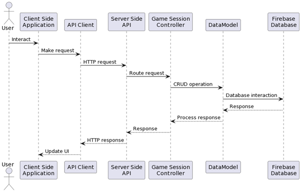

## Computational Thinking Games API
This document provides a comprehensive explanation of the code for the Firebase Functions app that serves as an Express.js API for the Computational Thinking Games web application.

Table of Contents:
- Overview
- Setting Up the API Server
- Game Session Controller
- Validation Rules
- Error Handling
- Request Handling
- Database Operations
- Overview

The application is composed of the following main components:

- A server using Express.js
- Controllers for handling API routes
- Middleware for validation and error handling
- A DataModel class to interact with the Firebase Firestore database

### Setting Up the API Server
The createServer function sets up the Express.js server, enabling CORS with the given corsOptions, and adding JSON parsing middleware. It also registers the controllers passed as an argument.

```javascript
function createServer(controllers, corsOptions) {
    const app = express();

    app.use(cors(corsOptions));
    app.use(express.json());

    controllers.forEach((controller) => {
        app.use(controller.path, controller.handler);
    });

    return app;
}
```
The server is then created and exported as a Firebase function.

```javascript
const app = createServer(controllers, corsOptions);
exports.api = functions.region('europe-west1').https.onRequest(app);
```
## Game Session Controller
The Game Session controller is an Express.js router that handles the following CRUD operations for game sessions:

- Get all game sessions
- Get a game session by ID
- Create a new game session
- Update an existing game session using PATCH or PUT
- Delete a game session

Each route handler is wrapped in an asyncHandler to catch and pass errors to the error handling middleware. The handlers also use the success, notFound, and error response functions to send appropriate HTTP responses.




## Validation Rules
The validation rules for creating and updating game sessions are defined using the express-validator library. The rules are applied as middleware to the route handlers for the POST, PATCH, and PUT operations.

```javascript
const createGameValidationRules = checkSchema({
    // ... (validation rules for creating game sessions)
});

const updateGameValidationRules = checkSchema({
    // ... (validation rules for updating game sessions)
});
```
## Error Handling
The handleErrors middleware function is responsible for handling errors occurring in the route handlers. It logs the error and sends an appropriate HTTP response with the error message and status code.

```javascript
function handleErrors(err, res) {
    // ... (handle errors and send appropriate responses)
}
```
## Request Handling
The asyncHandler, success, error, notFound, and custom functions are used in the route handlers to handle asynchronous operations, send successful HTTP responses, handle errors, send not found responses, and send custom HTTP responses, respectively.

```javascript
function asyncHandler(controllerFn) { /* ... */ }
function success(res, data, status = 200) { /* ... */ }
function error(res, message, status = 400) { /* ... */ }
function notFound(res, message = 'Not Found') { /* ... */ }
function custom(res, data, status) { /* ... */ }
```
## Database Operations
The Database class is a singleton that wraps the Firebase Firestore database and provides CRUD operations for documents. The class has the following methods for interacting with the database:

- `create(collection, document)`: Creates a new document in the specified collection with the given data.
- getList(collection): Retrieves a list of documents from the specified collection.
- get(collection, id): Retrieves a document with the specified ID from the specified collection.
- set(collection, id, document): Updates the document with the specified ID in the specified collection with the given data.
- del(collection, id): Deletes the document with the specified ID from the specified collection.

```javascript
class Database {
    // ... (constructor and initialization)

    async create(collection, document) { /* ... */ }
    async getList(collection) { /* ... */ }
    async get(collection, id) { /* ... */ }
    async set(collection, id, document) { /* ... */ }
    async del(collection, id) { /* ... */ }
}
```

## DataModel
The DataModel class is a wrapper around the Database class that provides a more convenient interface for performing CRUD operations on specific collections. It has the following methods:

- getAll(): Retrieves all documents from the collection.
- getById(id): Retrieves a document with the specified ID from the collection.
- create(data): Creates a new document in the collection with the given data.
- update(id, data): Updates the document with the specified ID in the collection with the given data.
- delete(id): Deletes the document with the specified ID from the collection.

``` javascript
class DataModel {
    constructor(collectionName) { /* ... */ }

    async getAll() { /* ... */ }
    async getById(id) { /* ... */ }
    async create(data) { /* ... */ }
    async update(id, data) { /* ... */ }
    async delete(id) { /* ... */ }
}
```

The gameSessionModel is an instance of the DataModel class that interacts with the gameSessions collection in the database.

```javascript
const gameSessionModel = new DataModel('gameSessions');
```

Database Operations Flow

## Conclusion
This document has provided a comprehensive explanation of the code for the Firebase Functions app that serves as an Express.js API for the Computational Thinking Games web application. The code is organized into modules for setting up the API server, handling API routes, managing validation, error handling, request handling, and performing database operations.