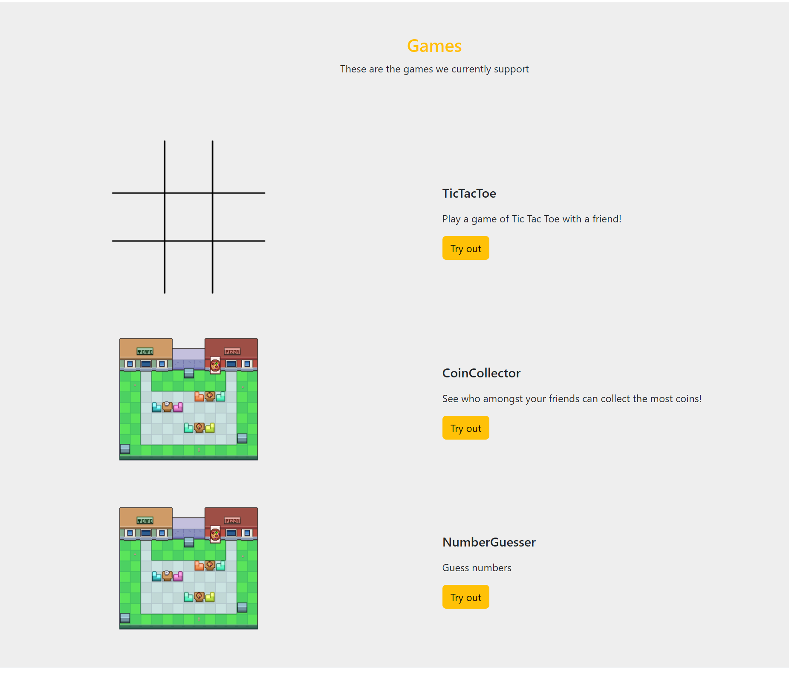
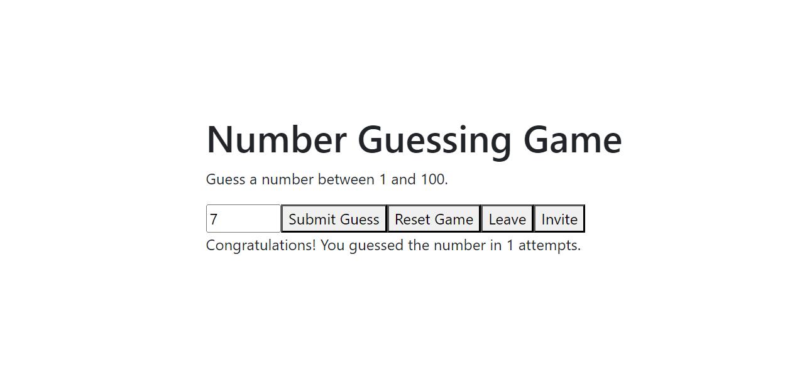

## Number Guessing Game Tutorial

In this tutorial, we will create a simple number guessing game using React. The game will generate a secret number between 1 and 100, and the user will try to guess the secret number.

### Step 1: Create the NumberGuesser Game component

First, create a new file called `NumberGuesser.js` and import the necessary React hooks and components.

```javascript
import React, { useState, useEffect } from 'react';
```

Now, let's create the `NumberGuesser` functional component and initialize the state for secret number, user's guess, message, and attempts.

```javascript
function NumberGuesser() {
  const [secretNumber, setSecretNumber] = useState(null);
  const [userGuess, setUserGuess] = useState('');
  const [message, setMessage] = useState('');
  const [attempts, setAttempts] = useState(0);
}
```

### Step 2: Generate the secret number

Create a function called `generateSecretNumber` that generates a random number between 1 and 100, and sets the `secretNumber` state.

```javascript
function generateSecretNumber() {
  setSecretNumber(Math.floor(Math.random() * 100) + 1);
}
```

Use the `useEffect` hook to call `generateSecretNumber` when the component mounts.

```javascript
useEffect(() => {
  generateSecretNumber();
}, []);
```

### Step 3: Handle user input

Create a function called `handleUserGuess` that updates the `userGuess` state when the user enters a guess.

```javascript
function handleUserGuess(e) {
  setUserGuess(e.target.value);
}
```

### Step 4: Check the user's guess

Create a function called `checkGuess` that checks the user's guess and updates the `message` and `attempts` states accordingly.

```javascript
function checkGuess() {
  const guess = parseInt(userGuess, 10);
  setAttempts(attempts + 1);

  if (guess === secretNumber) {
    setMessage(`Congratulations! You guessed the number in ${attempts} attempts.`);
  } else if (guess < secretNumber) {
    setMessage('Too low! Try again.');
  } else {
    setMessage('Too high! Try again.');
  }
}
```

### Step 5: Reset the game

Create a function called `resetGame` that resets the game state.

```javascript
function resetGame() {
  generateSecretNumber();
  setUserGuess('');
  setMessage('');
  setAttempts(0);
}
```

### Step 6: Render the component

Finally, render the component with the necessary elements and event handlers.

```javascript
return (
  <div>
    <h1>Number Guessing Game</h1>
    <p>Guess a number between 1 and 100.</p>
    <input
      type="number"
      min="1"
      max="100"
      value={userGuess}
      onChange={handleUserGuess}
    />
    <button onClick={checkGuess}>Submit Guess</button>
    <button onClick={resetGame}>Reset Game</button>
    <p>{message}</p>
  </div>
);
```

Close the `NumberGuesser` component and export it as the default.

```javascript
import React, { useState, useEffect } from 'react';

export default function NumberGuesser() {
  const [secretNumber, setSecretNumber] = useState(null);
  const [userGuess, setUserGuess] = useState('');
  const [message, setMessage] = useState('');
  const [attempts, setAttempts] = useState(0);

  useEffect(() => {
    generateSecretNumber();
  }, []);

  function generateSecretNumber() {
    setSecretNumber(Math.floor(Math.random() * 100) + 1);
  }

  function handleUserGuess(e) {
    setUserGuess(e.target.value);
  }

  function checkGuess() {
    const guess = parseInt(userGuess, 10);
    setAttempts(attempts + 1);

    if (guess === secretNumber) {
      setMessage(`Congratulations! You guessed the number in ${attempts} attempts.`);
    } else if (guess < secretNumber) {
      setMessage('Too low! Try again.');
    } else {
      setMessage('Too high! Try again.');
    }
  }

  function resetGame() {
    generateSecretNumber();
    setUserGuess('');
    setMessage('');
    setAttempts(0);
  }

  return (
    <div>
      <h1>Number Guessing Game</h1>
      <p>Guess a number between 1 and 100.</p>
      <input
        type="number"
        min="1"
        max="100"
        value={userGuess}
        onChange={handleUserGuess}
      />
      <button onClick={checkGuess}>Submit Guess</button>
      <button onClick={resetGame}>Reset Game</button>
      <p>{message}</p>
    </div>
  );
}

```

### Step 7: Create the main page

Now, create a new file called `numberGuesser.js` in the page directory and import the `NumberGuesser` and use it as a component.

```javascript
import React from 'react';
import NumberGuesser from '@/games/NumberGuesser';

export default function numberGuesser() {
  return (
    <div>
      <NumberGuesser />
    </div>
  );
}
```

Run your local development server and navigate to `http://localhost:3000/numberGuesser` and play the game!

With these changes, our Number Guessing Game is now more modular, easier to maintain, and test, thanks to the custom hooks that encapsulate the different parts of the game logic.

## Extension: Creating an Online Multiplayer Number Guessing Game

In this second half of the tutorial, we will extend our Number Guessing Game to support online multiplayer gameplay using the built-in functions provided by Computational Thinking Games. By doing this, users can play with friends or other players online, making the game more interactive and engaging.

### Step 8: Create a data model for Game Service
The first step in creating an online multiplayer version of the Number Guessing Game is to define a data model that will be used for initializing the game in the database. This model will hold the game's state, including the secret number, attempts, and maximum number of participants allowed.

```javascript
export class NumberGuesser {
    constructor() {
        this.secretNumber = null;
        this.attempts = 0;
        this.maxParticipants = 2;
    }

    toString() {
        return JSON.stringify({
            secretNumber: this.secretNumber,
            attempts: this.attempts,
            maxParticipants: this.maxParticipants,
        });
    }
}
```

This class is responsible for holding the essential information needed to run the game, such as the secretNumber, attempts, and maxParticipants. The toString method allows us to easily convert the object to a JSON string, which is useful when storing the game state in the database.

### Step 9: Updating the GameFactory
The GameFactory is responsible for creating new instances of games based on the game type. To add our new Number Guesser game, we will update the createGame and createGameInstance functions in the GameFactory. These functions will create a new instance of the NumberGuesser class when the game type is 'numberguesser'.

```javascript
import errorHandler from '@/helpers/errorHandler';
// other games...
import { NumberGuesser } from '../games/NumberGuesser';

export function createGame(type) {
    let game;
    if(!type) {
        errorHandler(new Error('type must not be null'), 'createGame');
        return null;
    }
    switch (type.toLowerCase()) {
      // other games...
      case 'numberguesser':
          game = new NumberGuesser();
          return new GameSession(type, game, game.maxParticipants);
      default:
          errorHandler(new Error(`Invalid game type: ${type}`), 'createGame');
          return null;
    }
}

export function createGameInstance(type) {
    if(!type) {
        errorHandler(new Error('type must not be null'), 'createGameInstance');
        return null;
    }
    switch (type.toLowerCase()) {
      // other games...
      case 'numberguesser':
          return new NumberGuesser();
      default:
          errorHandler(new Error(`Invalid game type: ${type}`), 'createGameInstance');
          return null;
    }
}

```

This code adds a new case for the numberguesser game type. When this type is requested, the factory creates a new instance of the NumberGuesser class and returns a new GameSession with the appropriate type, game state, and max participants.

### Step 10: Updating the GamePageFactory
To dynamically render the appropriate game page component for each game type, we need to update the GamePageFactory. This factory is responsible for creating the game page components based on the game type provided.

In the GamePageFactory.js file, import the NumberGuesser component and add a new case for the numberguesser game type in the createGamePage function:

```javascript
import errorHandler from '@/helpers/errorHandler';
// other games...
import { NumberGuesser } from '@/games/NumberGuesser';

export function createGamePage(type, id) {
    if(!type || !id) {
        errorHandler(new Error('type and id must not be null'), 'createGamePage');
        return null;
    }
    switch (type.toLowerCase()) {
      // other games...
      case 'numberguesser':
          return (<NumberGuesser gameID={id}/>);
      default:
          errorHandler(new Error(`Invalid game type: ${type}`), 'createGamePage');
          return null;
    }
}

```

This update to the GamePageFactory allows the application to render the NumberGuesser component when the game type is 'numberguesser'. The gameID prop is passed to the component to associate it with the correct game session.

Now that we have made the required changes to integrate the Number Guessing Game into the existing application structure, we will proceed with creating hooks to handle game behavior and user interaction.

### Step 11: Create a utility function for generating a new secret number
Before creating hooks for game behavior, let's create a utility function for generating a new secret number. This function will be used in different parts of our code to generate a secret number within a specified range.

Create a new file called newSecret.js in the utils/numberguesser directory:

```javascript
export default function newSecret(min, max) {
    return Math.floor(Math.random() * max) + min;
}
```

This function takes two arguments, min and max, and returns a random integer within the specified range, inclusive of the endpoints.

With this utility function in place, we can now create hooks for the game behavior and user interactions. In the following steps, we will create custom hooks that handle various aspects of the Number Guessing Game's logic.

### Step 12: Create a custom hook for handling user guess and checking the guess
In this step, we will create a custom hook called useCheckGuess to handle the game logic for checking the user's guess and providing appropriate feedback. This hook will also manage the user's guess state.

First, we import the necessary dependencies:

```javascript
import { useState, useCallback } from 'react';
import errorHandler from '@/helpers/errorHandler';
import { updateGameState } from '@/services/games/GameService';
```

We define the useCheckGuess function, which takes three arguments: gameID, gameState, and setGameState. Inside the function, we use the useState hook to manage the userGuess state and its corresponding setter function, setUserGuess.

```javascript
export function useCheckGuess(gameID, gameState, setGameState) {
    const [userGuess, setUserGuess] = useState('');
}
```

We create a function called handleUserGuess and resetUserGuess that takes an event object as a parameter. This function updates the userGuess state with the user's input by calling setUserGuess and resets the userGuess.

```javascript
function handleUserGuess(e) {
    setUserGuess(e.target.value);
}

function resetUserGuess() {
    setUserGuess('');
}
```

We create another function called checkGuess that takes the current secret number as a parameter. This function checks whether the user's input is valid and converts it to an integer. We initialize a variable message to store the feedback message for the user. We also wrap this function in the useCallback hook to ensure that it is only re-created when the dependencies change (in this case, userGuess).

```javascript
const checkGuess = useCallback(async (secretNumber) => {
    if (!userGuess || isNaN(userGuess)) return;

    const guess = parseInt(userGuess, 10);
    let message = '';

```

We use conditional statements to check if the user's guess is equal to the secret number, lower than the secret number, or higher than the secret number. We then update the message variable accordingly.

We update the game state with the new message and increment the number of attempts using the setGameState function. We also update the game state in the game service by calling the updateGameState function. Finally, we reset the userGuess state to an empty string.

```javascript
        const data = {
            ...gameState,
            attempts,
            message,
        };

        setGameState(data);

        try {
            await updateGameState(gameID, data);
        } catch (error) {
            errorHandler(error, 'checkGuess');
        }

        setUserGuess('');
    }, [userGuess, gameState, setGameState]);

    return { userGuess, handleUserGuess, checkGuess, resetUserGuess };
}
```

You should be left with code looking like this:

```javascript
import { useState, useCallback } from 'react';
import errorHandler from '@/helpers/errorHandler';
import { updateGameState } from '@/services/games/GameService';

export function useCheckGuess(gameID, gameState, setGameState) {
    const [userGuess, setUserGuess] = useState('');

    function handleUserGuess(e) {
        setUserGuess(e.target.value);
    }

    function resetUserGuess() {
        setUserGuess('');
    }

    const checkGuess = useCallback(async (secretNumber) => {
        const guess = parseInt(userGuess, 10);
        const attempts = gameState.attempts + 1;
        let message;

        if (guess === secretNumber) {
            message = `Congratulations! You guessed the number in ${attempts} attempts.`;
        } else if (guess < secretNumber) {
            message = 'Too low! Try again.';
        } else {
            message = 'Too high! Try again.';
        }

        const data = {
            ...gameState,
            attempts,
            message,
        };

        setGameState(data);

        try {
            await updateGameState(gameID, data);
        } catch (error) {
            errorHandler(error, 'checkGuess');
        }
    }, [gameState, userGuess]);

    return { userGuess, handleUserGuess, checkGuess, resetUserGuess };
}
```

### Step 13: Creating a custom hook to handle leaving the game
In this step, we create a custom hook useExit that utilizes one of the pre-built hooks useGenericExit. This custom hook is responsible for managing the process of leaving the game. It needs to handle removing the user from the gameState, and if there's still another player in the game, it should reset the game before leaving.

First, we import the necessary dependencies, including useCallback from the React library, produce from the Immer library, removeParticipant, updateGameState from the GameService, and useGenericExitGame.

```javascript
import { useCallback } from 'react';
import produce from 'immer';
import { removeParticipant } from '@/services/games/GameService';
import { updateGameState } from '@/services/games/GameService';
import useGenericExitGame from '../useGenericExitGame';
```

Next, we define the useExit function, which takes the five parameters.

```javascript
export function useExit(gameID, gameState, setGameState, user, logOut) {
```

Inside the useExit hook, we define an asynchronous function called updateGame using the useCallback hook. This function takes two arguments: gameID and playerId. It uses produce to create a new resetGameObj based on the current gameState. Then, it resets the attempts, message, and secretNumber properties of the game state.

```javascript
    const updateGame = useCallback(async (gameID, playerId) => {
        const resetGameObj = produce(gameState, draftState => {
            draftState.attempts = 0;
            draftState.message = '';
            draftState.secretNumber = null;
        });

        const exists = await removeParticipant(playerId, gameID);
        if (exists) {
            setGameState(resetGameObj);
            await updateGameState(gameID, resetGameObj);
        }

        return exists;
    }, [gameState]);
```

Finally, we call the useGenericExitGame hook to obtain the exitGame function, which we return from our custom hook.

```javascript
    const { exitGame } = useGenericExitGame(gameID, user, updateGame, logOut);

    return { exitGame };
}
```

You should have something like this at the end:

```javascript
import { useCallback } from 'react';
import produce from 'immer';
import { removeParticipant } from '@/services/games/GameService';
import { updateGameState } from '@/services/games/GameService';
import useGenericExitGame from '../useGenericExitGame';

export function useExit(gameID, gameState, setGameState, user, logOut) {
    const updateGame = useCallback(async (gameID, playerId) => {
        const resetGameObj = produce(gameState, draftState => {
            draftState.attempts = 0;
            draftState.message = '';
            draftState.secretNumber = null;
        });

        const exists = await removeParticipant(playerId, gameID);
        if (exists) {
            setGameState(resetGameObj);
            await updateGameState(gameID, resetGameObj);
        }

        return exists;
    }, [gameState]);

    const { exitGame } = useGenericExitGame(gameID, user, updateGame, logOut);

    return { exitGame };
}
```

### Step 14: Creating a custom hook for resetting the game
In this step, we will create a custom hook called useGameReset that is responsible for resetting the game state back to its initial state.

First, we import the necessary dependencies, including errorHandler for handling errors, updateGameState for updating the game state in the database, newSecret for generating a new secret number, and useCallback from the React library.

```javascript
import errorHandler from '@/helpers/errorHandler';
import { updateGameState } from '@/services/games/GameService';
import newSecret from '@/utils/numberguesser/newSecret';
import { useCallback } from 'react';
```

Next, we define the useGameReset function, which accepts four arguments: gameID, gameState, setGameState, and resetUserGuess. These arguments are necessary to properly reset the game state and the user's guess.

```javascript
export function useGameReset(gameID, gameState, setGameState, resetUserGuess) {
```

Inside the useGameReset function, we define the resetGame function using the useCallback hook for better performance. The resetGame function creates a new game state object called data, which has the same properties as the current game state but with the attempts set to 0, the message set to an empty string, and the secretNumber set to a new secret number between 1 and 100. We then update the game state using the setGameState function.

```javascript
  const resetGame = useCallback(async () => {
      const data = {
          ...gameState,
          attempts: 0,
          message: '',
          secretNumber: newSecret(1, 100),
  };

  setGameState(data);
```

We use a try-catch block to call the updateGameState function, which updates the game state in the database with the new game state object data. If there is an error, we handle it using the errorHandler function. After updating the game state, we call the resetUserGuess function to reset the user's guess. And finally, we return the resetGame function as an array, allowing the game component to utilize this custom hook for resetting the game state.

```javascript
        try {
            await updateGameState(gameID, data);
        } catch (error) {
            errorHandler(error, 'resetGame');
        }

        resetUserGuess();
    }, [gameState]);
    return [resetGame];
}
```

Finally, we return the resetGame function as an array, allowing the game component to utilize this custom hook for resetting the game state.

By creating the useGameReset hook, we encapsulate the logic of resetting the game into a single, reusable function, making it easier to manage the game state in our game component. You should be left with the following code:

```javascript
import errorHandler from '@/helpers/errorHandler';
import { updateGameState } from '@/services/games/GameService';
import newSecret from '@/utils/numberguesser/newSecret';
import { useCallback } from 'react';

export function useGameReset(gameID, gameState, setGameState, resetUserGuess) {
    const resetGame = useCallback(async () => {
        const data = {
            ...gameState,
            attempts: 0,
            message: '',
            secretNumber: newSecret(1, 100),
        };

        setGameState(data);

        try {
            await updateGameState(gameID, data);
        } catch (error) {
            errorHandler(error, 'resetGame');
        }

        resetUserGuess();
    }, [gameState]);

    return [resetGame];
}

```

### Step 15: Creating a custom hook for initializing the game
In this step, we will create a custom hook called useInitializeGame. The purpose of this hook is to initialize the game when the component is rendered. We will be using the useEffect and useCallback hooks from React, along with the produce function from the immer library to create a new secret number for the game.

```javascript
import produce from 'immer';
import { useEffect, useCallback } from 'react';
import { useGenericInitializeGame } from '../useGenericInitializeGame';
import newSecret from '@/utils/numberguesser/newSecret';
```

First, we import the required dependencies, including the useGenericInitializeGame custom hook, which is responsible for managing the game initialization state.

```javascript
export function useInitializeGame(gameState, gameID, setGameState, user) {
    const { initialize, isInitialized } = useGenericInitializeGame();
}
```
We define the useInitializeGame function, which takes four arguments: gameState, gameID, setGameState, and user. Inside the function, we destructure the initialize and isInitialized properties from the useGenericInitializeGame hook.

```javascript
    const initializeGame = useCallback(async () => {
        if (gameState) {
            const updatedGameState = produce(gameState, draft => {
                draft.secretNumber = newSecret(1, 100);
            });

            if (JSON.stringify(updatedGameState) !== JSON.stringify(gameState)) {
                setGameState(updatedGameState);
                initialize(gameID, updatedGameState);
            }
        }
    }, [gameState, gameID]);
```

We create a new function initializeGame using the useCallback hook. This function checks if the gameState exists and, if it does, generates a new secret number using the newSecret utility function. The secret number will be a random number between 1 and 100. We use the produce function from the immer library to create a new updated game state object with the new secret number.

Next, we compare the updated game state object with the current game state object using their JSON string representations. If they are different, we update the game state using the setGameState function and call the initialize function from the useGenericInitializeGame hook with the gameID and updated game state as arguments.

```javascript
useEffect(() => {
    if (gameState && user && !isInitialized) {
        initializeGame();
    }
}, [gameState, user, isInitialized, initializeGame]);
```

We use the useEffect hook to call the initializeGame function when the component is rendered. The effect will only run if the gameState, user, and isInitialized conditions are met. This ensures that the game is only initialized once and that it is done when the user data and game state are available.

```javascript
import produce from 'immer';
import { useEffect, useCallback } from 'react';
import { useGenericInitializeGame } from '../useGenericInitialiseGame';
import newSecret from '@/utils/numberguesser/newSecret';

export function useInitialiseGame(gameState, gameID, setGameState, user) {
    const { initialize, isInitialized } = useGenericInitializeGame();
    
    const initializeGame = useCallback(async () => {
        if (gameState) {
            const updatedGameState = produce(gameState, draft => {
                draft.secretNumber = newSecret(1, 100);
            });

            if (JSON.stringify(updatedGameState) !== JSON.stringify(gameState)) {
                setGameState(updatedGameState);
                initialize(gameID, updatedGameState);
            }
        }
    }, [gameState, gameID]);

    useEffect(() => {
        if (gameState && user && !isInitialized) {
            initializeGame();
        }
    }, [gameState, user, isInitialized, initializeGame]);

    return { initializeGame };
}
```

### Step 16: Create a hook to organize all the game behavior
In this step, we will create a custom hook called useBehaviour that consolidates all the hooks we have created so far into one comprehensive hook. This will make it easier for our game component to utilize these hooks without dealing with the individual logic of each one.

First, we import all the custom hooks that we've created earlier, including useGameUpdate, useGameReset, useInitializeGame, useCheckGuess, and useExit.

```javascript
import useGameUpdate from '../useGameUpdate';
import { useGameReset } from './useGameReset';
import { useInitializeGame } from './useInitializeGame';
import { useCheckGuess } from './useCheckGuess';
import { useExit } from './useExit';
```

We define the useBehaviour function, which takes three arguments: gameID, user, and logOut. Inside the function, we destructure the gameState and setGameState properties from the useGameUpdate hook.

```javascript
export default function useBehaviour(gameID, user, logOut) {
    const { gameState, setGameState } = useGameUpdate(gameID);
}
```

We call the useInitializeGame hook, passing the required arguments: gameState, gameID, setGameState, and user. This hook initializes the game when the component is rendered.

```javascript
useInitializeGame(gameState, gameID, setGameState, user);
```

We destructure the userGuess, handleUserGuess, checkGuess, and resetUserGuess properties from the useCheckGuess hook, passing in the required arguments: gameID, gameState, and setGameState. Do the same for the rest of the hooks

```javascript
const {userGuess, handleUserGuess, checkGuess, resetUserGuess} = useCheckGuess(gameID, gameState, setGameState);
const [resetGame] = useGameReset(gameID, gameState, setGameState, resetUserGuess);
const { exitGame } = useExit(gameID, gameState, setGameState, user, logOut);
```

We create a new function called handleSubmitGuess that calls the checkGuess function with the current secret number from the game state. This function will be used in the game component to submit the user's guess.

```javascript
function handleSubmitGuess() {
    checkGuess(gameState.secretNumber);
}
```

Finally, we return an object containing the consolidated hooks and functions that the game component can use: gameState, userGuess, handleUserGuess, handleSubmitGuess, resetGame, and exitGame.

```javascript
    return {
        gameState,
        userGuess,
        handleUserGuess,
        handleSubmitGuess,
        resetGame,
        exitGame
    };
}
```

By creating this comprehensive hook, we make it easier for our game component to access all the necessary game logic and state management without directly dealing with the individual hooks. Below is the resulting hook:

```javascript
import useGameUpdate from '../useGameUpdate';
import { useGameReset } from './useGameReset';
import { useInitialiseGame } from './useInitialiseGame';
import { useCheckGuess } from './useCheckGuess';
import { useExit } from './useExit';

export default function useBehaviour(gameID, user, logOut) {
    const { gameState, setGameState } = useGameUpdate(gameID);
    useInitialiseGame(gameState, gameID, setGameState, user);
    const {userGuess, handleUserGuess, checkGuess, resetUserGuess} = useCheckGuess(gameID, gameState, setGameState);
    const [resetGame] = useGameReset(gameID, gameState, setGameState, resetUserGuess);
    const { exitGame } = useExit(gameID, gameState, setGameState, user, logOut);

    function handleSubmitGuess() {
        checkGuess(gameState.secretNumber);
    }

    return {
        gameState,
        userGuess,
        handleUserGuess,
        handleSubmitGuess,
        resetGame,
        exitGame
    };
}
```

### Step 17: Update the game component with the useBehaviour hook
Now that we have the useBehaviour hook to manage all the game-related hooks, we'll update the NumberGuesser game component to utilize it. This will allow us to simplify the game component and focus on the presentation layer.

First, we import the necessary modules, including memo from react, the useBehaviour hook we just created, the useAuth hook to access the authentication functionality, and the InviteModal component to allow users to invite others to play the game.

```javascript
import { memo } from 'react';
import useBehaviour from '@/hooks/games/numberguesser/useBehaviour';
import { useAuth } from '@/services/firebase/auth/AuthProvider';
import InviteModal from '@/components/modals/InviteModal';
```

We define the NumberGuesser component as a memoized functional component, which helps with performance by avoiding unnecessary re-rendering. We destructure the user and logOut properties from the useAuth hook.

```javascript
export const NumberGuesser = memo(({ gameID }) => {
    const { user, logOut } = useAuth();
})
```

We destructure the properties returned by the useBehaviour hook by passing in the required arguments: gameID, user, and logOut. This will give us access to the game state, user input handling, game logic, and exit functionality.

```javascript
const { gameState, userGuess, handleUserGuess, handleSubmitGuess, resetGame, exitGame} = useBehaviour(gameID, user, logOut);
```

In the JSX part of the component, we display a title and a brief instruction for the game.

```javascript
return (
    <div>
        <h1>Number Guessing Game</h1>
        <p>Guess a number between 1 and 100.</p>

```

We create an input element of type "number" for users to enter their guesses. The value attribute is set to userGuess, which is managed by the useBehaviour hook. We attach the handleUserGuess function to the onChange event, so the user's input is handled correctly.

```javascript
<input
    type="number"
    min="1"
    max="100"
    value={userGuess}
    onChange={handleUserGuess}
/>

```
We create a button to submit the user's guess. When clicked, it calls the handleSubmitGuess function provided by the useBehaviour hook.

```javascript
<button onClick={handleSubmitGuess}>Submit Guess</button>
```

We create two more buttons, one for resetting the game and another for leaving the game. These buttons call the resetGame and exitGame functions, respectively, which are also

```javascript
<button onClick={resetGame}>Reset Game</button>
<button onClick={exitGame}>Leave</button>
```

And lastly we add the InviteModeal which creates an invite button and the ability to join the game with a qr code and a display message.

```javascript
<InviteModal text={'Invite'} style={''} gameID={gameID}></InviteModal>
<p>{gameState?.message}</p>
```

The resulting code should look like this:

```javascript
import { memo } from 'react';
import useBehaviour from '@/hooks/games/numberguesser/useBehaviour';
import { useAuth } from '@/services/firebase/auth/AuthProvider';
import InviteModal from '@/components/modals/InviteModal';

export const NumberGuesser = memo(({ gameID }) => {
    const { user, logOut } = useAuth();
    const { gameState, userGuess, handleUserGuess, handleSubmitGuess, resetGame, exitGame} = useBehaviour(gameID, user, logOut);

    return (
        <div>
            <h1>Number Guessing Game</h1>
            <p>Guess a number between 1 and 100.</p>
            <input
                type="number"
                min="1"
                max="100"
                value={userGuess}
                onChange={handleUserGuess}
            />
            <button onClick={handleSubmitGuess}>Submit Guess</button>
            <button onClick={resetGame}>Reset Game</button>
            <button onClick={exitGame}>Leave</button>
            <InviteModal text={'Invite'} style={''} gameID={gameID}></InviteModal>
            <p>{gameState?.message}</p>
        </div>
    );
});
```

### Step 18: Adding it the Home Page
Now that all the components have been added together, all thats left is to add the game to homepage so users can play your new game. To make the game visible on the home page, we need to edit the text.config.js like so:

```javascript
export const textConfig = {
    PAGES : {
        HOME: {
            INTRO: {
                // ...
            },
            AIM: {
                // ...
            },
            GAMES: {
                TITLE: 'Games',
                GAMES_SUPPORT: 'These are the games we currently support',
                GAMES_LIST: [
                    // ...
                    {
                        img: './images/games/coincollector/map.png', 
                        title : 'NumberGuesser', 
                        desc : 'Guess numbers', 
                        game : 'numberguesser',
                        buttonText: 'Try out'
                    }
                ],
            }
        },
    },
    COMMON : {
        // ...
    }
};
```
Now, the Number Guessing Game is available for online multiplayer gameplay using the built-in functions provided by Computational Thinking Games. Test your changes locally and make sure to delete the NumberGuesser page we created in the first half of the tutorial.

```node
npm run dev
```





