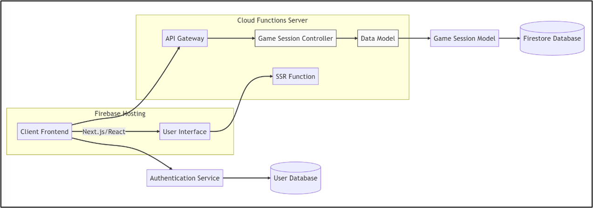
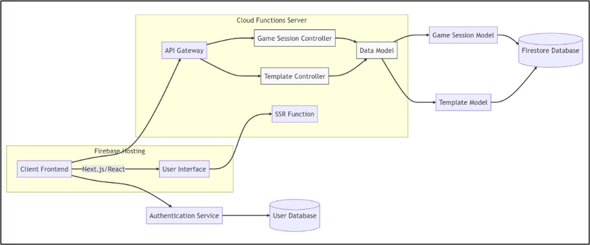
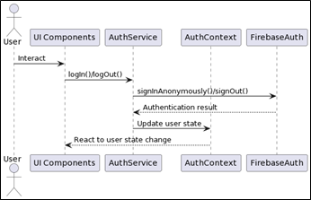
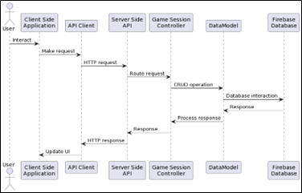

# The Client-Server Architecture

The client-server architecture provides a clear separation between the front and backend, promoting scalability, maintainability, and performance.

The client-side web application is built using Next.js, a React-based framework, which handles user interactions, renders the user interface, and communicates with the server-side API. By leveraging Next.js features, such as server-side rendering (SSR) and static site generation, the application achieves improved performance and SEO. 

A Firebase function is employed to support Next.js SSR, further enhancing the application's capabilities. Firebase Functions serve as an efficient and scalable solution for data storage and management, eliminating the need for a separate server. 

On the server side, the Express.js API manages client requests, processes data, and interfaces with the Firebase Functions serverless backend allowing the application to automatically scale with demand, reducing overhead and ensuring a consistently responsive user experience.

The client-side web application built using Next.js, a React-based framework, handles user interactions, renders the user interface, and communicates with the server-side API. 

The modular design makes it easy to add new controllers and endpoints, as illustrated above. This extensibility assures the application may evolve to accommodate changing requirements and use cases. In addition, by leveraging Express.js middleware and a well-structured routing system, developers can effortlessly create and integrate new API endpoints, promoting maintainability and scalability.

In addition, the server-side code employs a custom DataModel class to encapsulate interactions with the Firebase database allowing for basic CRUD operations on collections and documents and abstracting the Firebase implementation away from the application.

### Client-Side User Management Integration

The client-side application manages user authentication, user interaction, and session management. Firebase Authentication enables users to sign in anonymously and maintain their session across the application. 
- The FirebaseAuthService handles user authentication. 
- React hooks (useState, useEffect, and useContext) manage the user's state and update the user's session based on Firebase Authentication events.

The client-side components and Firebase Authentication interactions are illustrated below. 

### Client-Server Integration

The client-side application HTTP requests are routed to the appropriate Game Session Controller by the server-side API as per the figure below, handling requests to API endpoints for operations such as updating or deleting documents in a collection. The client-side code also takes care of error handling and response parsing. 

 

### Performance, Scalability, Extensibility, and Security

Server-side rendering enhances page load speed, while the serverless architecture of Firebase Functions provides on-demand scaling. The modular design of the system, which includes components such as GameFactory, GamePageFactory, GameService, QRCodeGenerator, and authentication and data management services, allows for easy addition of new components and endpoints, ensuring extensibility.

In terms of security, user authentication and session management are provided by Firebase Authentication. CORS (Cross-Origin Resource Sharing) middleware assures that only whitelisted cross-origin requests access the API. Additionally, data validation techniques prevent common security vulnerabilities such as injection attacks and cross-site scripting. These security measures, combined with the platform's performance optimization components like caching and load balancing, create a robust and secure environment for developing browser-based educational games.
