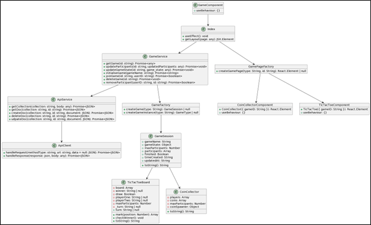
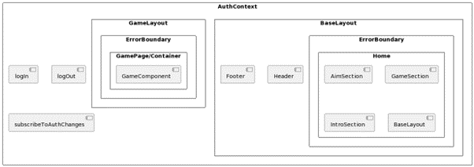

## System Modelling and Diagrams

This section presents a high-level over of compoents that represent the overall structure and organization of the system. The focus is on showcasing the relationships between main components and the system's organization.

 

Above presents a class diagram displaying how the main components are organized into classes. The table below describes the classes and components. These are all denoted as classes(only TicTactoe, CoinCollector and GameSession are classes/obejects) for the sake of visualisation.

| Class/Component           | Description |
|---------------------------|-------------|
| GameComponent             | Represents a generic game component. |
| ApiService                | Contains methods to interact with the server and perform CRUD operations on collections and documents. |
| ApiClient                 | Handles requests and responses from the server, providing a layer of abstraction for the ApiService. |
| GameService               | Provides various game-related methods, such as initializing games, joining games, and updating game states |
| Index                     | Represents the main entry point of the application, responsible for rendering game components and layouts |
| GameSession               | Represents a game session, containing information about the game state, participants, and other relevant data. |
| TicTacToeBoard and CoinCollector | Represent specific game implementations, containing game logic and state management. |
| GameFactory               | A factory object that is responsible for creating instances of game sessions and game instances based on the game type |
| CoinCollectorComponent and TicTacToeComponent | Represent the React components for the specific games, each containing their respective useBehaviour. |
| GamePageFactory           | A factory object that creates the appropriate game page based on the game type and ID. |

UI Component
-------------
The UI component diagram in Figure 6 below presents the organization of the user interface components within the system demonstrates the interactions between UI components.

 

In the UI component diagram, we can see the following main components:

| UI Component     | Description |
|------------------|-------------|
| AuthContext       | Provides the authentication context for the application, managing login, logout, and subscription to authentication changes. |
| BaseLayout       | Represents the base layout for the application, including the Header and Footer components. |
| ErrorBoundary    | A component that catches JavaScript errors anywhere in its child component tree and displays a fallback UI instead of the crashed component tree |
| Home             | Represents the home page of the application, containing AimSection, GameSection, and IntroSection components. |
| GameLayout       | Represents the layout for the game page, including the GameComponent wrapped within an ErrorBoundary component |
| GameContainer       | Represents the component that contains the game component and provides pre-configured tooling |