Low-Level Design
-----------------
This section focuses on the low-level design of the application, highlighting the interactions between components and services. It provides an in-depth understanding of the communication patterns, method specifications, and other implementation specifics that contribute to the overall functionality and performance of the system.

This section focuses on the low-level design of the application, highlighting the interactions between components and services. It provides an in-depth understanding of the communication patterns, method specifications, and other implementation specifics that contribute to the overall functionality and performance of the system.

### Design Methodologies

Our application leverages various design patterns, principles, and best practices to promote scalability, reusability, and extensibility:

SOLID Design Principles: The application follows the SOLID design principles, ensuring a maintainable and scalable codebase. These principles include Single Responsibility, Open/Closed, Liskov Substitution, Interface Segregation, and Dependency Inversion.
- Single Responsibility: Each component and class is designed to handle a single responsibility, promoting modularity and separation of concerns.
- Open/Closed: The application is designed to be open for extension but closed for modification, allowing for easy addition of new features without altering existing code.
- Liskov Substitution: Derived classes and components are designed to be interchangeable with their base types, ensuring consistency and reliability.
- Interface Segregation: In the context of JavaScript applications, interface segregation means creating smaller, focused modules or functions instead of large ones, improving flexibility and maintainability.
- Dependency Inversion: High-level modules are designed to depend on abstractions rather than concrete implementations, making the application more adaptable and easier to change.

React Design Principles:
- Component-based Architecture: The application is built using a component-based architecture, allowing for modularity, reusability, and better organization of code.
- Hooks: React Hooks are used throughout the application to manage state and side effects in a functional and declarative manner, promoting a cleaner and more maintainable codebase.
- Context API: The application utilizes the Context API for managing shared state across components, providing a consistent and efficient way to handle global state.
- Middleware: Express.js middleware is used for handling common tasks such as validation, authentication, and error handling, promoting a clean and organized codebase.

By incorporating the SOLID design principles, React design patterns, and other best practices, our application effectively addresses the requirements. 

## Game Service

This subsection describes the sequences and interactions between the User, GameService, ApiService, ApiClient, and GameFactory, as illustrated Figure 7 Game Service Operations below. The diagram highlights the communication patterns and method calls involved in various game-related operations such as retrieving, updating, and deleting game sessions, as well as initializing and joining games.

The diagrams highlights the communication patterns and method calls involved in various GameService related operations such as retrieving, updating, and deleting game sessions, as well as initializing and joining games.

### GetGame
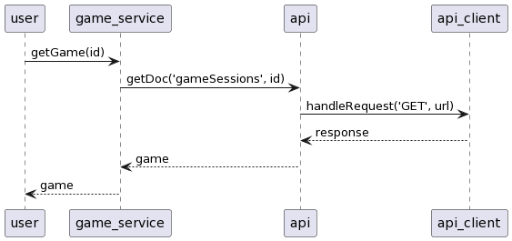

The User requests a game session by calling the getGame(id) method of the GameService. The GameService then communicates with the ApiService to fetch the requested document from the 'gameSessions' collection by calling the getDoc('gameSessions', id) method. The ApiService, in turn, makes a request to ApiClient's handleRequest('GET', url) method, which returns a response containing the game session data. This data is passed back through the ApiService and GameService to the User.

### UpdateParticipants
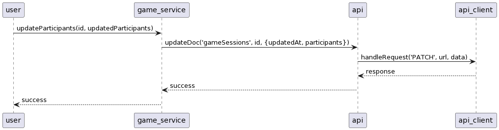

To update the participants of a game session, the User calls the updateParticipants(id, updatedParticipants) method in the GameService. The GameService then interacts with the ApiService to update the corresponding document in the 'gameSessions' collection, passing the updated participants and updatedAt fields. The ApiService calls ApiClient's handleRequest('PATCH', url, data) method, which returns a response indicating the success of the operation. This success status is passed back to the User.

### UpdateGameState
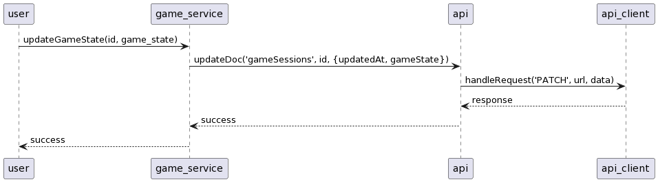

When the User wants to update the game state, they call the updateGameState(id, game_state) method of the GameService. The GameService communicates with the ApiService to update the corresponding document in the collection, providing the new game state and updatedAt fields. ApiService then calls ApiClient's handleRequest('PATCH', url, data) method, which returns a response indicating the success of the operation. This success status is passed back to the User.

### InitialiseGame
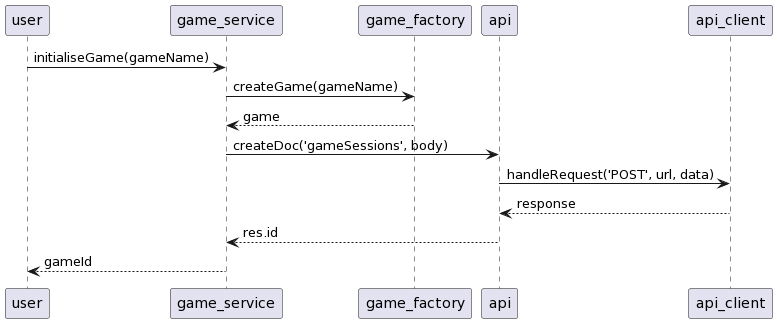

To initialize a new game, the User calls the initialiseGame(gameName) method of the GameService. The GameService then interacts with the GameFactory to create a new game instance by calling the createGame(gameName) method. The GameFactory returns the new game instance to the GameService, which then passes the game data to the ApiService to create a new document in the collection. ApiService calls the ApiClient's handleRequest('POST', url, data) method, which returns a response containing the new game session's ID. This ID is passed back to the User.

### JoinGame
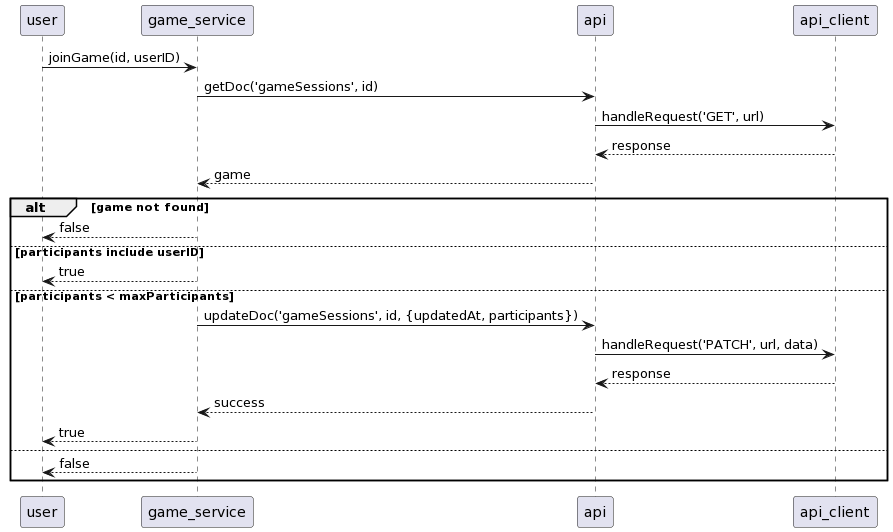

When the User wants to join an existing game, they call the joinGame(id, userID) method of the GameService. The GameService retrieves the game session using the ApiService's getDoc('gameSessions', id) method, and the ApiService communicates with the ApiClient to fetch the data. Based on the game session's data, the GameService checks if the User is allowed to join the game. If the game is not found, or the maximum number of participants has been reached, the User receives a 'false' status. If the User is already a participant or is allowed to join, the GameService updates the participants list and returns a 'true' status.

### DeleteGame
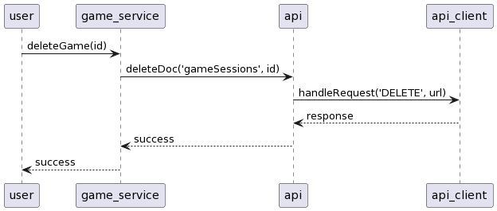

To delete a game session, the User calls the deleteGame(id) method in the GameService. The GameService then communicates with the ApiService to delete the corresponding document from the 'gameSessions' collection. ApiService calls ApiClient's handleRequest('DELETE', url) method, which returns a response indicating the success of the operation. This success status is passed back to the User.

### RemoveParticipant
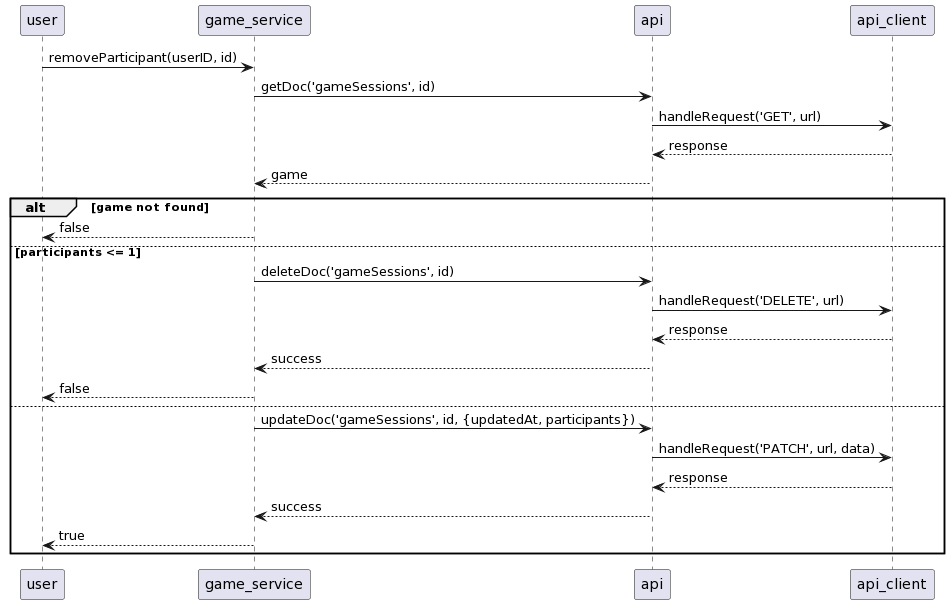

The User requests to remove a participant (by user ID) from a game by providing the game ID to the GameService. The GameService retrieves the game data from the ApiService and checks if the game exists. If the game doesn't exist or there's only one participant left, the GameService deletes the game and returns false to the User. Otherwise, the GameService updates the participants, sends the updated data to the ApiService, which uses the ApiClient to send an HTTP PATCH request. The ApiClient returns a response indicating the success of the operation. This success status is passed back to the User.

## Game Management

This sequence diagram illustrates the interactions between the User, Router, Index component, AuthProvider, GameService, GamePageFactory, GameContainer, and GameLayout. It shows how the user navigates to the game URL, logs in, and attempts to join the game. The diagram highlights the cases when the user successfully joins the game and when the maximum number of players has been reached.

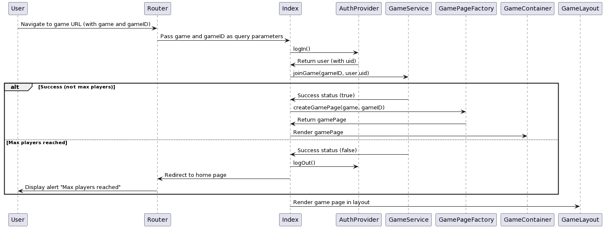

- User navigates to the game URL with game and gameID as query parameters.
- The Router passes the game and gameID parameters to the Index component.
- Index component calls the logIn() method of the AuthProvider to log the user in.
- AuthProvider returns the logged-in user with a unique ID (uid).
- Index component calls the joinGame(gameID, user.uid) method of the GameService to attempt joining the game.
- GameService checks if the user can join the game:
  - If successful (not max players):
    - GameService returns a success status (true) to the Index component.
    - Index component calls the createGamePage(game, gameID) method of the GamePageFactory.
    - GamePageFactory returns the gamePage to the Index component.
  - Index component renders the gamePage inside the GameContainer.
    - If maximum players have been reached:
    - GameService returns a success status (false) to the Index component.
    - Index component calls the logOut() method of the AuthProvider to log the user out.
    - Index component redirects the user back to the home page using the Router.
    - User is alerted that the maximum number of players has been reached.
- Index component renders the game page inside the GameLayout.

### Creating and Join Games

The subsection explains the processes that occur when a user clicks the "Create Game" or "Join Game" button. The explanation is based on the following diagrams:

### Create Game Process

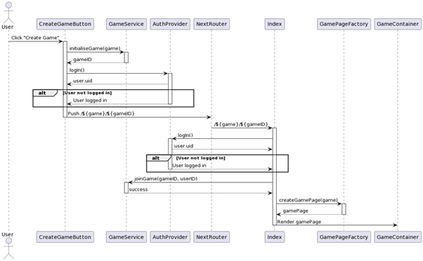

- **User clicks "Create Game" button:**
   The User clicks the "Create Game" button, which triggers the CreateGameButton component.

- **Initializing a new game:**
   The CreateGameButton component sends a request to the GameService to initialize a new game using the provided `game` type. The GameService returns the `gameID` of the newly created game session to the CreateGameButton component.

- **User authentication:**
   The CreateGameButton component then requests the AuthProvider to log in the user. If the user is not logged in, the AuthProvider logs them in and returns the `user.uid`.

- **Navigating to the game page:**
   Once the user is logged in, the CreateGameButton component uses NextRouter to navigate to the game page with the path `/${game}/${gameID}`.

- **Accessing the game page:**
   Upon accessing the game page, the Index component requests the AuthProvider to log in the user. If the user is not logged in, the AuthProvider logs them in and returns the `user.uid`.

- **Joining the created game:**
   The Index component sends a request to the GameService to join the game using the `gameID` and `userID`.

- **Creating the game page:**
   Upon success, the Index component requests the GamePageFactory to create the game page based on the game type. The GamePageFactory returns the appropriate gamePage component.

- **Rendering the game page:**
   The Index component then renders the gamePage inside the GameContainer component.

### Join Game Process Through Invite Code

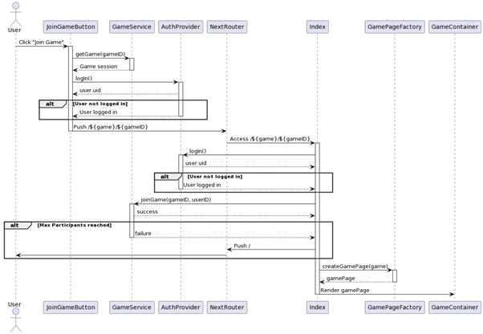

- **User clicks "Join Game" button:**
   The User clicks the "Join Game" button, which triggers the JoinGameButton component.

- **Retrieving the game session:**
   The JoinGameButton component sends a request to the GameService to get the game session using the provided `gameID`. The GameService returns the game session to the JoinGameButton component.

- **User authentication:**
   The JoinGameButton component then requests the AuthProvider to log in the user. If the user is not logged in, the AuthProvider logs them in and returns the `user.uid`.

- **Navigating to the game page:**
   Once the user is logged in, the JoinGameButton component uses NextRouter to navigate to the game page with the path `/${game}/${gameID}`.

- **Accessing the game page:**
   Upon accessing the game page, the Index component requests the AuthProvider to log in the user. If the user is not logged in, the AuthProvider logs them in and returns the `user.uid`.

- **Joining the game:**
   The Index component sends a request to the GameService to join the game using the `gameID` and `userID`. If the maximum number of participants has not been reached, the GameService returns a success status. Otherwise, it returns a failure status.

- **Handling the join game result:**
   If joining the game fails due to reaching the maximum number of participants, the Index component uses NextRouter to navigate back to the root page (`/`). If joining the game is successful, the Index component continues to the next step

### Join Game Process Through Invite Link/QRCode

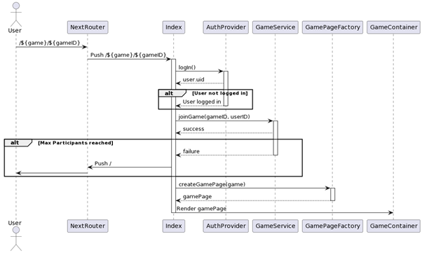

- **User joins through invite link:**
   Upon entering the link, NextRouter will navigate to the game page with the path `/${game}/${gameID}`.

- **Accessing the game page:**
   Upon accessing the game page, the Index component requests the AuthProvider to log in the user. If the user is not logged in, the AuthProvider logs them in and returns the `user.uid`.

- **Joining the game:**
   The Index component sends a request to the GameService to join the game using the `gameID` and `userID`. If the maximum number of participants has not been reached, the GameService returns a success status. Otherwise, it returns a failure status.

- **Handling the join game result:**
   If joining the game fails due to reaching the maximum number of participants, the Index component uses NextRouter to navigate back to the root page (`/`). If joining the game is successful, the Index component continues to the next step
   
## Game/Hook Components Interaction

This subsection uses TicTactoe as an example to demonstrate the interactions between the components and hooks provided by the Software.

### Components
- TicTacToe: The main game component that renders the game board, player scores, and other elements. It makes use of the useBehaviour custom hook to manage the game state and actions.
- PlayerScore: Component to display the wins of each player.
- InviteModal: A modal to invite other players to the game.
Hooks

### Hooks
- useBehaviour: A custom hook to manage and organize the behavior of the game. It imports several hooks to manage game updates, marking, restarting, exiting, and initializing the game.
- useGameUpdate: Hook to get the game state and set it.
- useUpdateWins: Hook to manage the wins of each player.
- useMark: Hook to handle marking a position on the game board.
- useRestart: Hook to handle restarting the game.
- useExit: Hook to handle the exit action of the game.
- useInitializeGame: Hook to handle initializing the game state.

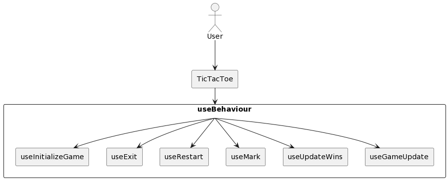

- User interacts with the TicTacToe component by marking positions on the game board, restarting the game, or exiting the game.
- The TicTacToe component utilizes the useBehaviour custom hook, which in turn makes use of several hooks to manage specific aspects of the game:
  - useGameUpdate: Responsible for getting and updating the game state.
  - useUpdateWins: Manages the wins of each player during the game.
  - useMark: Handles marking a position on the game board when a user interacts with it.
  - useRestart: Takes care of restarting the game when the user decides to do so.
  - useExit: Handles the user's exit action from the game.
  - useInitializeGame: Sets up the initial game state, such as setting the first player to make a move.
- Each of these hooks communicates with the useBehaviour hook, which then updates the TicTacToe component accordingly, this method of organising game components and hooks provides a modular, maintainable and allows for future addition of features for developers.