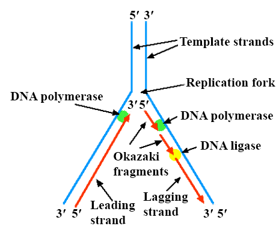
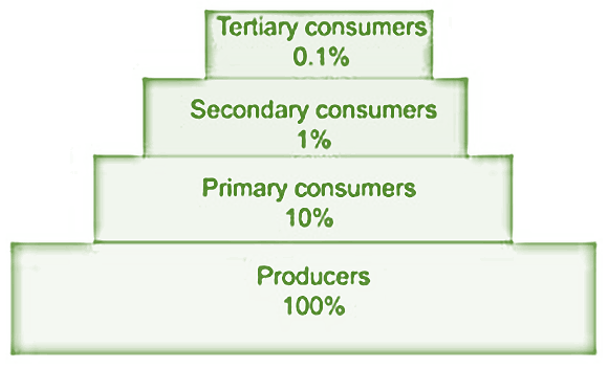
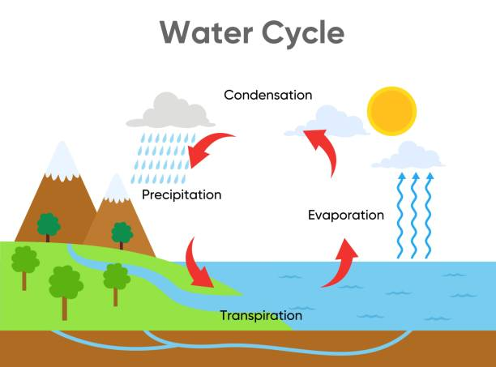

## Question 1

### I.

1) *What is the main function of DNA?* **(1 mark)**
   - The main function of **DNA** (Deoxyribonucleic Acid) is to store and transmit genetic information that tells cells which proteins to make and when to make them.

2) *What is the main function of RNA?* **(1 mark)**
   - The main function of **RNA** (Ribonucleic Acid) is to read the genetic information in DNA and use it to produce proteins.

3) *List three structural differences between DNA and RNA.* **(3 marks)**
   - Three structural differences between DNA and RNA are: 
     - DNA is double-stranded, while RNA is single-stranded.
     - DNA uses the sugar deoxyribose, while RNA uses the sugar ribose.
     - DNA uses the bases adenine (A), guanine (G), cytosine (C), and thymine (T), while RNA uses adenine (A), guanine (G), cytosine (C), and uracil (U) instead of thymine.

### II.

1) *What type of bond exists between the DNA base pairs?* **(1 mark)**
   - The type of bond that exists between the DNA base pairs is the **hydrogen bond**.

2) *What are the three main components of a nucleotide?* **(1 mark)**
   - The three main components of a nucleotide are a **phosphate group**, a **5-carbon sugar** (deoxyribose in DNA, ribose in RNA), and a **nitrogenous base**.

3) *In the structure of DNA what bond holds the sugar and bases together?* **(1 mark)**
   - In the structure of DNA, the bond that holds the sugar and bases together is a **covalent bond**.

4) *Name two bases that are purines.* **(2 marks)**
   - Two bases that are purines are **adenine (A)** and **guanine (G)**. 

### III.
*With the aid of a labelled diagram explain in detail the process of meiosis I.* **(10 marks)**

Meiosis I is the first part of meiosis, which is a type of cell division that produces four daughter cells, each with half the number of chromosomes as the parent cell. It's important in sexual reproduction because it creates sperm and egg cells. Meiosis I has several steps:

1. **Prophase I**: The DNA coils up and the chromosomes become visible. Each chromosome pairs up with its matching chromosome to form a structure called a bivalent or tetrad, which has four chromatids. This is when crossing over can happen, where parts of chromosomes swap over, increasing genetic diversity.

2. **Metaphase I**: The paired chromosomes line up in the middle of the cell. The spindle fibers attach to each pair of chromosomes.

3. **Anaphase I**: The spindle fibers pull the pairs of chromosomes apart. Each pair goes to an opposite end of the cell.

4. **Telophase I and Cytokinesis**: The cell splits into two new cells, each with one of each pair of chromosomes. This is different from mitosis, where each new cell would have two of each chromosome. At the end of Meiosis I, there are two cells, each with a unique combination of chromosomes due to crossing over.

 

### IV.

**(a)** *How many daughter cells are produced?* **(2 marks)**
   - In **mitosis**, two daughter cells are produced. In **meiosis**, four daughter cells are produced. 

**(b)** *How many cell divisions take place?* **(2 marks)**
   - One cell division takes place in **mitosis** (Mitosis: Prophase, Metaphase, Anaphase, Telophase). Two cell divisions take place in **meiosis** (Meiosis I: Prophase I, Metaphase I, Anaphase I, Telophase I; Meiosis II: Prophase II, Metaphase II, Anaphase II, Telophase II). 

**(c)** *How many chromosomes are present in daughter cells?* **(2 marks)**
   - In **mitosis**, each daughter cell has the same number of chromosomes as the parent cell. In **meiosis**, each daughter cell has half the number of chromosomes as the parent cell. 

**(d)** *What is the cell type produced? *
   - **Mitosis** produces two identical diploid (2n) somatic cells. **Meiosis** produces four genetically different haploid (n) gametes. (2 marks)

**(e)** *What is the function of each cell division process?* **(2 marks)**
   - The function of **mitosis** is growth, repair, and asexual reproduction. The function of **meiosis** is sexual reproduction and providing genetic diversity. 

### V.
With the aid of a labelled diagram discuss in detail the DNA replication process. **(20 marks)**

DNA replication is the process by which DNA makes a copy of itself during cell division. This process is crucial for life because it allows cells to reproduce.

1. **Initiation**: The process starts with the unwinding of the DNA double helix at specific areas called origins of replication. An enzyme called DNA helicase breaks the hydrogen bonds between the base pairs, causing the two strands to separate and form a replication fork.

2. **Elongation**: Each separated strand serves as a template for synthesizing a new complementary strand. DNA polymerase reads the existing strand and adds new nucleotides that complement the existing ones (A with T, and G with C in the case of DNA) in the 5' to 3' direction. Because DNA strands are antiparallel (run in opposite directions), one new strand (leading strand) is synthesized continuously, while the other (lagging strand) is synthesized in fragments, known as Okazaki fragments. 

3. **Termination**: Once the entire molecule is copied, an enzyme called DNA ligase helps join the Okazaki fragments on the lagging strand, creating a continuous new strand. The result of DNA replication is two DNA molecules, each with one old (original) strand and one newly synthesized strand. This is known as semi-conservative replication. 

By the end of the process, each new DNA molecule is identical to the original, ensuring that when cells divide, each new cell has the same genetic information.

 

### Summary
- **DNA** and **RNA** are both essential for life as we know it: DNA stores our genetic blueprint, while RNA reads this blueprint to build proteins.
- DNA and RNA are made up of building blocks called **nucleotides**. These nucleotides are linked together by **covalent bonds**, while **hydrogen bonds** hold together the two strands of DNA.
- **Purines** (adenine and guanine) are one of the two types of nitrogenous bases in DNA and RNA. The other type is pyrimidines.
- **Meiosis** is a special type of cell division that produces gametes (eggs or sperm) for sexual reproduction. It consists of two rounds of cell division, meiosis I and II, and results in four daughter cells, each with half the number of chromosomes as the parent cell.
- **Mitosis**, on the other hand, is a type of cell division that allows for growth and repair. It results in two daughter cells that are genetically identical to the parent cell.
- **DNA replication** is the process by which a cell copies its DNA. It's an essential part of cell division because each new cell needs a full set of DNA to function.

## Question 2

### I.
The gender of offspring is determined by the male parent in mammals. How does this happen? **(5 marks)**

Males have XY chromosomes and females have XX chromosomes. So, females can only give X chromosome to the offspring, while males can give either X or Y. If the male gives X, the offspring is female (XX). If the male gives Y, the offspring is male (XY). So, the male determines the sex of the offspring.

### II.
**1)** *What is sex –linkage?* **(1 mark)**

Sex linkage refers to genes that are located on the sex chromosomes (X and Y in mammals). These genes are inherited differently than genes on non-sex chromosomes.

**2)** *What does homozygous mean?* **(1 mark)**

An organism is homozygous for a gene when it has two identical copies of that gene, one on each of its homologous chromosomes.

**3)** *What are gametes?* **(1 mark)**

Gametes are reproductive cells (sperm in males, eggs in females) that carry one copy of each gene (i.e., they are haploid).

**4)** *What is a centromere?* **(1 mark)**

A centromere is the part of a chromosome that links sister chromatids. During cell division, spindle fibers attach to the centromere via the kinetochore.

**5)** *What is a phenotype?* **(1 mark)**

A phenotype is the physical expression of a gene or set of genes - basically, it's the traits you can see in an organism.

### III.
*A broad-leaved red flowered snapdragon was crossed with a narrow-leaved white flowered
snapdragon and all the offspring were broad-leaved with pink flowers. Using a punnett square
to show your work answer the following questions.*

**(a)** *Why were all the offspring broad-leaved?* **(1 mark)**

This could be because the gene for broad leaves is dominant. So, all offspring received at least one copy of this gene.

**(b)** *Why did all offspring have pink flowers?* **(1 mark)**

This could be due to incomplete dominance, where the red and white alleles both contribute to the phenotype, resulting in pink flowers.

**(c)** *List the phenotypes that may result from a cross between two plants heterozygous for both traits.* **(8 mark)**

There could be many different phenotypes, including broad-leaved red flowers, broad-leaved white flowers, broad-leaved pink flowers, narrow-leaved red flowers, narrow-leaved white flowers, and narrow-leaved pink flowers.

### IV. 
*Give a detailed description of the process that is happening in the diagram below.* **(10 marks)**

[Description of the process in the diagram]

### V.
*With the aid of a labelled diagram, discuss the formation of mRNA.* **(20 marks)**

[Description of mRNA formation with a labelled diagram]

## Question 3

### I.

**1)** *Define evolution* **(2 marks)**

   Evolution is the process by which species of organisms undergo change over time through the gradual accumulation of small genetic variations. This process leads to the emergence of new species and variations within species.

**2)** *Define natural selection* **(3 marks)**

   Natural selection is a process in evolution where organisms that are better adapted to their environment tend to survive and produce more offspring. It's often summed up as "survival of the fittest".

### .II.

**1)** *Define speciation and give an example* **(3 marks)**

   Speciation is the evolutionary process by which new biological species arise. An example would be the development of different finch species in the Galapagos Islands, a process studied by Charles Darwin.

**2)** *Name two differences between hominid and early humans.* **(2 marks)**

   Hominids include all species that evolved after the human lineage or the hominins split from the line that led to chimpanzees. Early humans (Homo sapiens) are a subset of hominids. Two differences might be: early humans developed more complex tools, and they had larger brain sizes relative to body size.

### III.
*Discuss in detail how sudden and gradual speciation may occur.* **(10 marks)**

Sudden speciation, also known as punctuated equilibrium, is when new species appear suddenly in the fossil record and then remain unchanged over long periods of time. This could occur due to a sudden environmental change or a large mutation.

Gradual speciation, or phyletic gradualism, is the idea that species slowly change through a gradual change in population characteristics. Over time, these small, gradual changes can accumulate to the point that the population is significantly different from the original population, leading to a new species.

### IV.
*What are the five trends that mark human evolution?* **(10 marks)**

1. Bipedalism: Standing up right and walking on two legs.
2. Brain size: Over time, brain size increased among human ancestors.
3. Diet: Changes in diet can be seen through physical changes in teeth and jaw structure.
4. Tool use: The creation and use of tools became more sophisticated over time.
5. Social behavior: There is evidence of increasingly complex social structures, including care for the elderly and sick.

### V.
*Describe in detail what microevolution is and the role natural selection plays in this process.* **(20 marks)**

Microevolution is the changes in allele frequencies that occur over time within a population. This is generally caused by natural selection, mutation, genetic drift, and gene flow.

Natural selection plays a major role in microevolution. When the environment changes, certain traits may become more or less beneficial. Individuals with beneficial traits are more likely to survive and reproduce, passing on their genes to the next generation. Over time, these changes can lead to significant differences in the population's genetic makeup.

## QUESTION 4

### I.

**1)** *The study of the interaction of organisms with one another and the environment is known as…* **(2 marks)**

   Ecology

**2)** *The place where an organism lives is called it’s …* **(2 marks)**

   Habitat

**3)** *Many different populations living in one area is called a …* **(2 marks)**

   community

**4)** *A large naturally occurring community of flora and fauna occupying a major habitat is known as a …* **(2 marks)**

   ecosystem

**5)** *Non-living things such as the wind and temperature are known in ecology as .. factors.* **(2 marks)**

   abiotic

### II.

**1)** *Describe what is meant by a narrow and broad niche.* **(5 marks)**

   A narrow niche is one where a species has a very specific set of requirements, such as a certain type of food or a specific habitat. A broad niche is one where a species can survive in a wide range of conditions and eat a variety of foods.

**2)** *Give an example of a species that would occupy each niche described.* **(5 marks)**

   The koala is an example of a species with a narrow niche, as it primarily eats eucalyptus leaves. The raccoon is an example of a species with a broad niche, as it can survive in a variety of environments and eat a wide range of food.

### III.

**1)** *Define a food chain.* **(5 marks)**

   A food chain is a linear sequence of organisms through which nutrients and energy pass as one organism eats another.

**2)** *Give an example of a food chain with four trophic levels.* **(5 marks)**

   An example of a food chain with four trophic levels would be: grass (producer) → rabbit (primary consumer) → fox (secondary consumer) → wolf (tertiary consumer).

**3)** *Describe how energy flows through this food chain. In your discussion explain how energy is lost as it travels from one trophic level to the next.* **(10 marks)**

   Energy flows through the food chain from producers to consumers. Each time an organism eats another, only about 10% of the energy from the food is stored in the consumer's body and passed on to the next level. The rest is lost as heat or used for the organism's life processes, such as movement and reproduction.

### IV.

*An ecological pyramid is a graphical representation of the relationship between different organisms in an ecosystem. There are three types of ecological pyramids. One of these pyramids is the pyramid of numbers. With the aid of a diagram describe in detail what this is.* **(20 marks)**

   A pyramid of numbers shows the relative number of individual organisms at each trophic level in an ecosystem. The base of the pyramid represents the producers, and each subsequent layer represents the consumers at the next trophic level. The pyramid shape occurs because in a healthy ecosystem, there are fewer consumers than producers.

 
   

### V.

*The hydrologic cycle is the biogeochemical cycle that describes the continuous movement of
water on, above and below the surface of the Earth. With the aid of a labelled diagram
describe the hydrologic cycle.* **(40 marks)**

The hydrologic cycle, also known as the water cycle, describes the continuous movement of water on, above, and below the surface of the Earth. It involves several key stages:

   1. **Evaporation**: This is the process where water from the surface (like oceans, lakes, rivers) turns into water vapor due to heat from the sun. 

   2. **Transpiration**: Water is also lost to the atmosphere from plants in a process called transpiration.

   3. **Condensation**: As the water vapor rises into the atmosphere, it cools and condenses to form tiny droplets, which group together to form clouds.

   4. **Precipitation**: When the water droplets in the clouds become too heavy, they fall to the Earth's surface as precipitation (rain, snow, sleet, or hail).

 